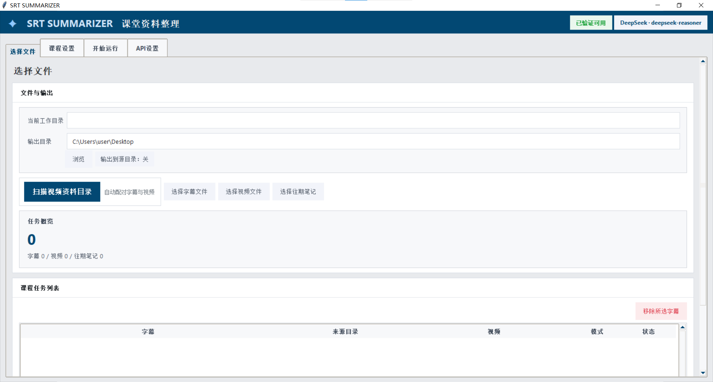

<div align="center">

# SRT SUMMARIZER

### 把课堂字幕、转录文本和视频截图，整理成一份真正适合复习的 Markdown 课程笔记

面向日常学习场景的桌面整理工具，适合课程回顾、考前复习、补课复盘与长期笔记沉淀。



</div>

---

## 一句话介绍

SRT SUMMARIZER 不是通用聊天工具，而是专门围绕 **“课堂资料整理”** 设计的桌面应用。

它会把字幕、转录文本、视频截图、往期笔记这些原本分散的材料，整理成一份**结构更清晰、阅读更顺畅、方便长期复习**的 Markdown 课程笔记。

---

## 适合谁使用

- 想把课堂字幕快速整理成复习笔记的学生
- 有大量录播资料，需要批量整理的人
- 希望把“字幕 + 截图 + 往期笔记”整合起来复盘课程的人
- 想持续积累整门课笔记，而不是只做一次性总结的人

---

## 核心亮点

### 更像“课堂整理工具”，而不是聊天窗口
整个流程围绕课堂资料处理设计：选择字幕、配对视频、补充上下文、填写课程信息、生成笔记，不需要自己反复组织提示词。

### 图文混排，理解成本更低
字幕成功配对到视频后，程序会自动抽取课堂截图，并尽量插入到更合适的位置附近，帮助理解定义、推导、图示、板书和例题过程。

### 支持批量整理
可以直接扫描整个视频资料目录，更适合长期课程资料整理，而不只是处理单节课。

### 输出结果便于沉淀
最终结果是 Markdown 文件，方便归档、二次编辑、检索和长期保存。

---

## 你可以用它做什么

- 把 `.srt` / `.txt` / `.md` 整理成结构化课程笔记
- 自动配对同名视频，生成图文混排结果
- 批量扫描视频资料目录，减少手动导入成本
- 引入往期笔记，让新笔记与前文保持连续
- 在界面中保存 API 配置，下次启动自动恢复
- 在生成过程中实时查看进度和模型输出
- 选择输出到固定目录，或直接输出到源文件目录

当前内置平台：

- `DeepSeek`
- `OpenAI Compatible`

---

## 使用前先准备什么

开始之前，你通常需要准备这几样：

- 一份字幕或转录文件（`.srt` / `.txt` / `.md`）
- 如果要图文混排，还需要对应视频文件
- 一个可用的 API 平台账号
- 对应平台的 API Key
- 模型名称和接口地址

---

## 如何获取 API

程序本身**不提供 API**，你需要先从所使用的平台申请。

通用流程通常是：

1. 注册你要使用的模型平台账号
2. 进入该平台的开发者后台 / API 管理页面
3. 创建或复制你的 API Key
4. 查看该平台提供的：
   - 接口地址（Base URL）
   - 可用模型名称
5. 回到本程序，在 **API设置** 页面填写并保存

你至少需要准备这 4 项：

- API 平台
- 模型名称
- 接口地址
- API Key

### 小提示

- 如果你使用的是 **DeepSeek**，就去 DeepSeek 官方平台的开发者/API 页面申请 Key。
- 如果你使用的是 **OpenAI Compatible**，就去你实际接入的那家兼容平台申请 Key，并填写它提供的接口地址和模型名。
- `OpenAI Compatible` 只是接口格式兼容，不代表所有平台都能混用同一个地址或模型名。
- 不同平台的 API Key、模型名、接口地址通常都不一样，照着对应平台文档填写即可。

### 安全提示

- 不要把自己的 API Key 发给别人
- 不要把 API Key 提交到 git 仓库
- 如果怀疑泄露，应尽快去平台后台重新生成

---

## 典型使用流程

### 1. 配置 API
打开程序后，在 **API设置** 页填写并保存：

- API 平台
- 模型名称
- 接口地址
- API Key

程序启动时会自动校验当前配置：

- 配置可用时：直接进入界面，不额外打扰
- 配置缺失或不可用时：自动跳转到 **API设置** 页并显示提示

### 2. 选择资料
在 **选择文件** 页中，你可以：

- 选择字幕文件
- 扫描视频资料目录
- 选择视频文件
- 选择往期笔记

如果希望生成图文混排结果，需要为字幕配对对应视频。

### 3. 补充课程信息
在 **课程设置** 页中填写：

- 课程名称
- 课程总体要求（可留空）

### 4. 开始生成
切换到 **开始运行** 页，点击 **开始整理**，程序就会开始生成课程笔记。

---

## 输出结果长什么样

每个任务通常会生成一个独立课程目录，例如：

```text
某节课_来源目录_课程名/
├── 某节课_课程名_课堂总结.md
└── imgs/
    ├── 001.png
    └── ...
```

其中：

- `课堂总结.md`：最终整理结果
- `imgs/`：抽取出的课堂截图
- 纯字幕任务：通常不会生成 `imgs/`

这种结构更适合归档，也方便把一节课的相关内容放在一起管理。

---

## 图文混排说明

当字幕成功配对到视频后，任务会进入 **图文混排** 模式：

- 程序会尝试从视频中提取课堂截图
- 截图会被插入到 Markdown 笔记中
- 插图会优先服务于更难理解、更需要视觉辅助的内容
- **如果视频任务没有成功提取到有效截图，该任务会直接失败**
- 不会自动降级为纯文字整理

这样可以避免“本来想生成图文版，结果悄悄退回纯文本”的混乱情况。

---

## 快速开始

### 方式一：直接双击启动
运行：

```text
start.bat
```

启动脚本会自动：

1. 检查 Python
2. 检查 tkinter
3. 安装依赖
4. 检查 `ffmpeg`
5. 启动程序

### 方式二：命令行启动

```bash
python -m pip install -r requirements.txt
python app.py
```

---

## 配置保存在哪里

程序会自动保存配置到：

```text
~/.srt_summarizer/settings.json
~/.srt_summarizer/secrets.json
```

下次启动时会自动读取。

---

## 运行环境

建议环境：

- Windows 10 / 11
- Python 3.10+

安装 Python 时建议勾选：

- `Add Python to PATH`
- `tcl/tk and IDLE`

---

## 如果启动失败，可以先检查

- Python 是否已正确安装
- Python 是否已经加入 PATH
- tkinter 是否可用
- API Key / 接口地址是否填写正确
- 启动时的配置校验提示里是否有具体报错
- 视频模式下 `ffmpeg` 是否可用